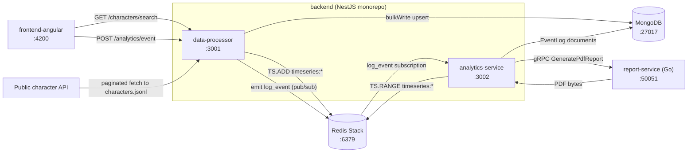

# Test Assignment

A polyglot monorepo implementing the assignment: an Angular frontend with
typeahead search and canvas polygon editing, two NestJS microservices, and a Go gRPC service that
renders PDF reports with charts.

```
test-assigment/
├── frontend-angular/     Angular 22 app (NgRx, Tailwind, CDK virtual scroll, Canvas)
├── backend/              NestJS monorepo — 2 microservices + shared library
│   ├── apps/data-processor/       Service A: ingestion, search, event publishing
│   ├── apps/analytics-service/    Service B: event log store, log API, PDF report API
│   └── libs/shared/               Mongo connection, schemas, cross-service DTOs
├── report-service/       Go gRPC service — PDF/chart generation
├── shared/proto/         report.proto — contract shared by NestJS and Go
├── docker/               Docker Compose (infra + apps)
└── .env / .env.example   Single env file for the whole backend
```

---

## Architecture



### Request / event flow

1. **Search.** Typing in the UI debounces (300 ms), dispatches `searchRequest`, and a `switchMap`
   effect calls `GET /characters/search` on **data-processor**, which queries MongoDB with indexed
   matching and skip/limit pagination.
2. **Tracking.** A `dispatch: false` NgRx effect fires `POST /analytics/event` for every meaningful
   search and every created polygon. **data-processor** does two things with it: increments a
   RedisTimeSeries key (`timeseries:searches` / `timeseries:polygons`) and emits `log_event` over
   the Redis transporter.
3. **Logging.** **analytics-service** subscribes to `log_event` via `@EventPattern` and persists an
   `EventLog` document in MongoDB. Logs are queryable at `GET /logs` with filters and pagination.
4. **Reporting.** `GET /report` reads both time series with `TS.RANGE ... AGGREGATION sum 60000`,
   packs them into a `ReportRequest`, and calls the Go **report-service** over gRPC. Go renders one
   line chart per metric with `go-chart`, lays them out on A4 pages with `gofpdf`, and streams the
   PDF bytes back for the client to download inline.

---

## Projects

### `frontend-angular` — Angular 22 (SSR)

Standalone components, zoneless change detection, Tailwind CSS v4, NgRx 22.

| Assignment requirement                     | Where it lives                                                                                             |
| ------------------------------------------ | ---------------------------------------------------------------------------------------------------------- |
| Typeahead, no submit button                | `components/typeahead-search` — `valueChanges` + `debounceTime(300)` + `distinctUntilChanged`              |
| Network optimization                       | `switchMap` in `store/effects/search.effects.ts` cancels in-flight requests                                |
| Virtual scroller + batch pagination        | `cdk-virtual-scroll-viewport` (`itemSize="72"`), `scrolledIndexChange` appends the next page               |
| Query history via NgRx Entity              | `store/reducers/search.reducer.ts` — `createEntityAdapter`, `upsertOne` only when a query returned results |
| Past-query suggestions with word breakdown | `selectQuerySuggestions` splits input on whitespace and matches any term                                   |
| Row click opens image dialog               | `components/image-dialog`                                                                                  |
| Canvas polygon drawing                     | `image-dialog.component.ts` — click to place points, _Finish Polygon_ to commit (min. 3 points)            |
| Polygons persisted per character           | `store/reducers/polygon.reducer.ts` — `polygonsByCharacter: Record<number, Polygon[]>`                     |
| Drag & drop reposition                     | click inside a polygon and drag (`onMouseDown` / `onMouseMove`)                                            |
| Rotation around centroid                   | hold **Alt** and drag; the angle is computed from the centroid                                             |
| Ratio preserved on resize                  | points are stored as normalized `0..1` coordinates and multiplied by canvas size at draw time              |

**Store shape:** `{ search: SearchState, polygons: PolygonState }`. Actions are declared with
`createActionGroup`; reducers, selectors, and effects are split into
`store/{actions,reducers,selectors,effects,models}`.

### `backend/apps/data-processor` — Service A (`:3001`)

- `POST /characters/sync` — fully in-code ingestion: walks every page of the public API, handles
  HTTP 429 with exponential backoff (30 s, doubling, 5 attempts), streams results to
  `characters.jsonl`, then reads that file back line-by-line via `readline` and upserts into
  MongoDB in `bulkWrite` batches of 100 (idempotent on `externalId`).
- `GET /characters/search?query=&page=&limit=` — case-insensitive match on `name` / `species` with
  `total` and `totalPages`; both fields are indexed in `character.schema.ts`.
- `POST /analytics/event` — validated by `TrackEventDto`; writes to RedisTimeSeries and publishes
  `log_event`.
- Swagger UI: <http://localhost:3001/api/docs>

### `backend/apps/analytics-service` — Service B (`:3002`)

Runs as a hybrid app: an HTTP server _plus_ a connected Redis microservice listener.

- `@EventPattern('log_event')` — persists incoming events as `EventLog` documents.
- `GET /logs?eventType=&startDate=&endDate=&page=&limit=` — filter by event type and timestamp
  range (epoch ms), sorted newest-first, paginated (max 100 per page).
- `GET /report` — returns `application/pdf` generated by the Go service over gRPC.
- Swagger UI: <http://localhost:3002/api/docs>

### `backend/libs/shared` — shared library (`n/shared/*`)

Imported through the `n/shared` path alias declared in `backend/tsconfig.json` and mapped for Jest.

- `database/database.module.ts` — async `MongooseModule.forRootAsync` driven by `MONGO_URI`.
- `database/schemas/character.schema.ts`, `event-log.schema.ts` — Mongoose schemas and indexes.
- `dto/analytics.dto.ts` — `TrackEventDto` and its payload types, used by **both** services so the
  event contract is typed on the producer and the consumer.

### `report-service` — Go gRPC (`:50051`)

Implements `ReportGenerator.GeneratePdfReport` from
[`shared/proto/report.proto`](./shared/proto/report.proto). For each metric it renders a time-series
PNG chart (`go-chart/v2`) with labeled axes and a headroom-adjusted Y range, embeds it into an A4
PDF (`gofpdf`) with a title and date-range caption, and starts a new page when the next chart would
overflow. gRPC reflection is registered, so the service is introspectable with `grpcurl`.

The `.proto` is consumed from two directions: Go uses the pre-generated `pb/` package, while NestJS
loads the file at runtime (`protoPath`) and types the client with `grpc/report.interface.ts`.

---

## Getting started

### Prerequisites

Docker with Compose, and Node.js 20+ for the frontend (which is not containerized).

### 1. Environment

```bash
cp .env.example .env
```

`.env.example` ships with the Docker hostnames active (`mongodb`, `redis`, `report-service`) and the
localhost variants commented out — uncomment the top block if you intend to run the backend outside
Docker.

### 2. Backend and infrastructure

```bash
docker compose -f docker/docker-compose.yaml up --build
```

`docker/docker-compose.yaml` is a thin `include` of two files, so the pieces can come up separately
— useful when you want the databases in Docker but the services on the host:

```bash
docker compose -f docker/docker-compose.infra.yaml up -d   # MongoDB, mongo-express, Redis Stack
docker compose -f docker/docker-compose.apps.yaml up --build
```

The NestJS image is a single multi-stage `backend/Dockerfile` parameterized by `APP_NAME` and built
once per service; `shared/` is copied into the runtime image so the analytics service can resolve
the `.proto` at startup.

### 3. Frontend

```bash
cd frontend-angular
npm install
npm start          # http://localhost:4200
```

### 4. Load data

The database starts empty — trigger the ingestion once:

```bash
curl -X POST http://localhost:3001/characters/sync
```

Then search in the UI, draw a polygon or two, and download the report:

```bash
curl -o report.pdf http://localhost:3002/report
```

### Ports

| Service           | Port  | Notes                                           |
| ----------------- | ----- | ----------------------------------------------- |
| frontend-angular  | 4200  | `npm start` (dev server)                        |
| data-processor    | 3001  | REST + Swagger at `/api/docs`                   |
| analytics-service | 3002  | REST + Swagger at `/api/docs`, Redis subscriber |
| report-service    | 50051 | gRPC                                            |
| MongoDB           | 27017 | root credentials `admin` / `password`           |
| mongo-express     | 8081  | Mongo GUI, basic auth disabled                  |
| Redis Stack       | 6379  | includes the RedisTimeSeries module             |
| RedisInsight      | 8001  | Redis GUI                                       |

---

## Running the backend without Docker

```bash
cd backend
npm install
npm run start:dev data-processor       # :3001
npm run start:dev analytics-service    # :3002
```

```bash
cd report-service
go run main.go                         # :50051
```

Both Nest apps load the root `.env` by resolving four levels up from their compiled `dist`
directory, so the file stays in the repository root in both the local and the container layout.

### Useful scripts

| Location           | Command                              | Purpose                                      |
| ------------------ | ------------------------------------ | -------------------------------------------- |
| `backend`          | `npm run build <app>`                | Build one app into `dist/apps/<app>`         |
| `backend`          | `npm run lint` / `npm run format`    | ESLint (with `--fix`) / Prettier             |
| `backend`          | `npm test`                           | Jest (`*.spec.ts` under `apps/` and `libs/`) |
| `frontend-angular` | `npm run build`                      | Production SSR build                         |
| `frontend-angular` | `npm test`                           | Vitest via `@angular/build:unit-test`        |
| `report-service`   | `go build -o report-service main.go` | Compile the gRPC server                      |

Regenerating the Go stubs after editing the proto:

```bash
protoc --go_out=. --go-grpc_out=. --proto_path=shared/proto shared/proto/report.proto
```

---

## Assignment coverage

Both bonus items from `task.md` are implemented: ingestion and parsing happen entirely in code (no
manual download step), and the report API is a separate Go service reached over gRPC.

## Notes and known gaps

- **The frontend is not part of Docker Compose.** Run it with `npm start`; it talks to
  `http://localhost:3001`, hardcoded in `src/environments/environments.ts`.
- **The UI only consumes data-processor.** `GET /logs` and `GET /report` on port 3002 are documented
  in Swagger and exercised via curl, but no screen calls them yet.
